# Chart Styles Excel Add-in

A custom Excel add-in that applies organisational chart style standards from a dedicated ribbon tab. Select a data range, click a chart type, and the add-in creates a fully formatted chart — correct colours, fonts, sizing, layout, and branding — ready for publication.

This add-in was inspired by the [Urban Institute Data Visualisation Style Guide Excel Add-in](https://medium.com/urban-institute/introducing-the-urban-institute-data-visualization-style-guides-open-source-excel-add-in-14dfdfa50ebb), created by Jonathan Schwabish.

---

## Core Functionality

### Chart Creation

The ribbon provides buttons for the chart types in active use. Clicking a button creates a new chart from the current selection and applies the full formatting pipeline automatically.

| | Button | Chart Type |
|---|---|---|
|  | Column Chart | Clustered vertical bar |
|  | Stacked Column | 100% or absolute stacked vertical bar |
| 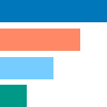 | Bar Chart | Clustered horizontal bar |
|  | Stacked Bar | 100% or absolute stacked horizontal bar |
|  | Lollipop Chart | Horizontal lollipop (bar chart with error-bar sticks and dot markers) |
|  | Line Chart | Standard line chart |
|  | Pie Chart | Pie chart |
|  | Donut Chart | Donut chart |

Each chart is created by duplicating a raw chart object, so the original data selection is preserved. The pipeline then applies: outer chart area formatting, plot area dimensions, axis styling, gridlines, series colours, title and subtitle text boxes, y-axis label box, logo, and source/notes placeholder.

The lollipop chart is built on top of the bar chart pipeline. After standard formatting is applied, each series bar is hidden and replaced with a horizontal error bar (extending from the value back to zero) formatted with an oval arrowhead at the value end — the stick and candy respectively. Stick and dot share the same colour per series.

### Data Colour Palette

Seven data colours form the core palette:

| | Name | Constant | Description |
|---|---|---|---|
|  | Ocean | `colorData1` | Primary blue |
|  | Coral | `colorData2` | Warm orange-red |
|  | Sky | `colorData3` | Light blue |
|  | Pine | `colorData4` | Teal-green |
|  | Gold | `colorData5` | Yellow |
|  | Rust | `colorData6` | Dark burnt orange |
|  | Lavender | `colorData7` | Soft purple |

 Silver (`colorNeutral1`) and  White (`colorNeutral4`) are available as neutral fills. Series beyond seven fall back to Silver.

**Palette ordering** can be toggled between two arrangements via the *Toggle Palette Order* button:

- **Contrasting:** Ocean → Coral → Sky → Pine → Gold → Rust → Lavender
- **Complementary:** Ocean → Lavender → Sky → Pine → Gold → Coral → Rust

### Colour Ramps

The *Colour Ramps* group applies single-hue sequential palettes to the series of the active chart. Each colour has a seven-step ramp from light to dark (constants `rampA1`–`rampG7`). Steps are assigned in spread order (5, 1, 3, 6, 2, 4, 7) so that charts with fewer series achieve maximum contrast rather than a compressed range of similar tones.

| | Ramp | | Ramp |
|---|---|---|---|
|  | Ocean (A) | 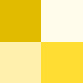 | Gold (E) |
| 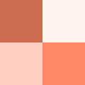 | Coral (B) | 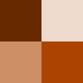 | Rust (F) |
| 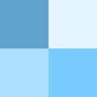 | Sky (C) | 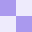 | Lavender (G) |
|  | Pine (D) | | |

The **Diverging Ramps** group places two ramps symmetrically: dark-to-light on the left side, light-to-dark on the right, with an optional neutral grey centre for odd series counts. Supports up to 15 series (7 + grey + 7).

| | Diverging ramp |
|---|---|
| 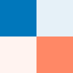 | Ocean — Coral |
| 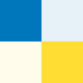 | Ocean — Gold |
| 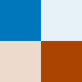 | Ocean — Rust |
| 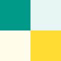 | Pine — Gold |
| 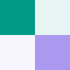 | Pine — Lavender |
| 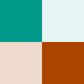 | Pine — Rust |

The **Invert** button reverses the current fill colour assignment across all series without re-applying a ramp, preserving any custom arrangement.

### Fill Colours

Per-colour buttons in the *Fill Colors* group apply a colour as a solid fill to any selected shape or chart element. Transparency can be specified via the button tag in the ribbon XML. A no-fill action removes the fill entirely.

| | | | | | | | | |
|---|---|---|---|---|---|---|---|---|
|  |  |  |  |  |  |  |  |  |
| Ocean | Coral | Sky | Pine | Gold | Rust | Lavender | Silver | White |

### Chart Tools

| | Button | Effect |
|---|---|---|
|  | Reset to Grey | Resets all chart series fills to Silver |
|  | Label Last Point | Adds series name labels to the final data point on line charts and narrows the plot area to make room |
| 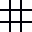 | Toggle Gridlines | Cycles the active chart through four gridline states: none → horizontal → vertical → both |
|  | Remove Legend | Deletes the chart legend and resizes the plot area to standard dimensions |

### Export

The  *Chart Export* button exports the active chart object as an image or PDF. Supported formats: PNG, GIF, JPG, BMP, SVG, PDF. The chosen format is remembered between sessions. The export does not warn before overwriting an existing file.

For higher-resolution images (e.g. for print use), right-click the chart and select *Save as Picture*.

---

## Requirements

- **Excel version:** 2013 or later. The ribbon XML uses the `customUI14` schema (Excel 2010+), and the `InsertChartField` API used for data labels requires Excel 2013+.
- **Operating system:** Windows only. The export function uses `GetSetting`/`SaveSetting` (Windows registry), and several chart formatting APIs behave differently or are unavailable on Mac Excel.

---

## Project Structure

| File/Folder | Role |
|---|---|
| `CustomUI14.xml` | Ribbon definition — tab layout, groups, buttons, image references, and `onAction` callback names |
| `modules/` | All VBA source files (`.bas`), tracked in git |
| `icons/` | Ribbon button PNG icons, tracked in git |
| `docs/` | Developer guides (branding, build, extending, workflow) |

### VBA Modules

| Module | Role |
|---|---|
| `modRibbonHandlers.bas` | Single entry-point layer for all ribbon callbacks. Thin wrappers only — one line per button, calling into the relevant module |
| `modChartBuilder.bas` | Shared formatting pipeline (`ApplyChartPipeline`) and all individual pipeline steps |
| `modChartColumn.bas` | Column and stacked column chart creation |
| `modChartBar.bas` | Bar and stacked bar chart creation |
| `modChartLine.bas` | Line chart creation |
| `modChartPie.bas` | Pie and donut chart creation |
| `modChartLollipop.bas` | Lollipop chart creation — wraps the bar chart pipeline, then replaces bars with error-bar sticks and oval arrowhead dots |
| `modFormatSeries.bas` | Palette application to chart series (fill and line modes); palette order toggle |
| `modFormatFill.bas` | Solid fill application and removal for selected shapes and chart elements |
| `modRamp.bas` | Single-hue sequential ramps, diverging ramps, and ramp inversion |
| `modConfigColors.bas` | Colour and ramp step constants |
| `modConfig.bas` | Layout, font, sizing, and export constants |
| `modEmbeddedImages.bas` | Organisation logo encoded as a Base64 string; decoded to a temp file at runtime for insertion into charts |
| `modChartTools.bas` | Post-creation chart utilities: label last point, toggle gridlines, remove legend and resize, reset to grey |
| `modExport.bas` | Chart export dialog and file-write logic |
| `modMessages.bas` | Shared error and status message strings |

---

## Installation

The repository stores the add-in as individual `.bas` source files and an XML ribbon definition. To build a working `.xlam`, follow [docs/guide_building_xlam.md](docs/guide_building_xlam.md).

**Tools required:**
- Microsoft Excel (2013+, Windows)
- The [Office Custom UI Editor](https://github.com/fernandreu/office-ribbonx-editor) (free, open source) for embedding the ribbon XML and button images

**Steps at a glance:**

1. Create a blank workbook and save as `.xlsm`.
2. Import all `.bas` files from `modules/` into the VBA editor in dependency order (see the build guide for the import order).
3. Verify compilation: Debug → Compile VBAProject.
4. Save as Excel Add-in (`.xlam`).
5. Open the `.xlam` in the Custom UI Editor. Embed `CustomUI14.xml` and import all icon images from `icons/`.
6. Load the add-in in Excel via File → Options → Add-ins.

The `.xlam` binary is not tracked in git. Each developer builds their own from the source. See the [development workflow guide](docs/guide_workflow.md) for the recommended edit → import → test → export loop.

---

## Customisation

To adapt the add-in for a different organisation, three files cover all brand-specific settings. See [docs/guide_branding.md](docs/guide_branding.md) for the full procedure and checklist.

**`modConfig.bas`** — identity, fonts, and layout:
```vb
Public Const orgName    As String = "COMPANY"   ' registry key and ribbon label
Public Const fontPrimary As String = "Calibri"  ' all chart text
Public Const chartWidth  As Double = 600        ' canvas width in points (8.33")
Public Const chartHeight As Double = 600        ' canvas height in points (8.33")
```

**`modConfigColors.bas`** — colours and ramp steps:
```vb
Public Const colorData1 As Long = 12285696   'Ocean    RGB(0, 119, 187)
Public Const colorData2 As Long = 6719743    'Coral    RGB(255, 136, 102)
' ...
Public Const rampA1 As Long = 15984847  ' Ocean step 1 (lightest)
' ...
Public Const rampA7 As Long = 6966282   ' Ocean step 7 (darkest)
```

Colour values are stored as Excel `Long` in BGR byte order. Use `?RGB(R, G, B)` in the VBE Immediate Window to convert a standard RGB value.

**`modEmbeddedImages.bas`** — the logo is embedded as a Base64 string. Replace the string in `LogoPNG_Base64()` with a Base64-encoded PNG of your organisation's logo. A PowerShell conversion script is provided in the branding guide.

**`CustomUI14.xml`** — the ribbon tab label is hardcoded and is not read from `orgName` at runtime. Find-and-replace `COMPANY` in the XML to update the tab label and all supertip text.

---

## Chart Specifications

All layout, sizing, font, and behaviour constants are defined in `modConfig.bas`. Values are in Excel points unless noted.

### Canvas

| Constant | Description | Value |
|---|---|---|
| `chartWidth` | Chart canvas width | `600` pt (8.33") |
| `chartHeight` | Chart canvas height | `600` pt (8.33") |

### Fonts

| Constant | Description | Value |
|---|---|---|
| `fontPrimary` | Body, axis, and title font | `"Calibri"` |
| `fontPrimaryItalic` | Italic variant — y-axis label, x-axis title | `"Calibri Italic"` |
| `titleFontSize` | Chart title | `24` pt |
| `subTitleFontSize` | Subtitle | `20` pt |
| `axisFontSize` | Axis tick labels, legend | `16` pt |

### Series (Bar and Column)

| Constant | Description | Value |
|---|---|---|
| `seriesGapWidth` | Gap between bar/column groups | `33`% |
| `seriesOverlap` | Overlap between bars within a group | `0`% |

### Plot Area

| Constant | Description | Value |
|---|---|---|
| `plotAreaHeight` | Plot area height | `408` pt |
| `plotAreaWidth` | Plot area width | `973` pt |
| `plotAreaTop_default` | Plot area top — single-series, or multi-series with legend | `158` pt |
| `plotAreaTop_noLegend` | Plot area top — multi-series, no legend | `116` pt |
| `plotAreaLeft` | Plot area left offset | `3` pt |
| `plotArea_noLegendSingleHeight` | Plot area height — single series, no legend | `421` pt |
| `plotArea_noLegendSingleTop` | Plot area top — single series, no legend | `105` pt |
| `plotArea_noLegendMultiHeight` | Plot area height — multi-series, no legend | `460` pt |
| `plotArea_noLegendMultiTop` | Plot area top — multi-series, no legend | `79` pt |

### X-Axis Title and Legend

| Constant | Description | Value |
|---|---|---|
| `xAxisTitle_plotGap` | Gap between plot area base and x-axis title label | `20` pt |
| `legend_top` | Legend top offset | `92` pt |
| `legend_leftPad` | Legend left offset | `7` pt |

### Title Boxes

| Constant | Description | Value |
|---|---|---|
| `titleBoxWidth` | Title and subtitle text box width | `394` pt |
| `titleBoxHeight` | Title text box height | `39` pt |
| `titleBoxNudge` | Top/left alignment nudge applied to title boxes | `5` pt |
| `subtitleBoxTop` | Subtitle text box top offset | `53` pt |
| `subtitleBoxHeight` | Subtitle text box height | `33` pt |
| `yAxisLabel_legendTop` | Y-axis label top — legend present | `126` pt |
| `yAxisLabel_singleTop` | Y-axis label top — single series, no legend | `85` pt |
| `yAxisLabel_multiTop` | Y-axis label top — multi-series, no legend | `68` pt |
| `yAxisLabel_legendHeight` | Y-axis label box height — legend present | `26` pt |
| `yAxisLabel_noLegendHeight` | Y-axis label box height — no legend | `24` pt |

### Source / Notes Box

| Constant | Description | Value |
|---|---|---|
| `sourceBoxWidth` | Source/notes text box width | `230` pt |
| `sourceBoxHeight` | Source/notes text box height | `46` pt |
| `sourceTextFontSize` | Source/notes font size | `11` pt |
| `sourceBoxLeftNudge` | Left offset nudge for source box | `5` pt |

### Logo

| Constant | Description | Value |
|---|---|---|
| `logoHeightScale` | Logo height as a fraction of chart height | `0.1` (10%) |
| `logoAspectRatio` | Logo width = height × this value | `1.8` |
| `logoMarginRight` | Logo right margin | `10` pt |
| `logoMarginBottom` | Logo bottom margin | `8` pt |

### Gridlines and Axes

| Constant | Description | Value |
|---|---|---|
| `gridlineWeight` | Major gridline stroke weight | `1` pt |
| `axisLineWeight` | X-axis line stroke weight | `1` pt |

### Pie and Donut

| Constant | Description | Value |
|---|---|---|
| `pieTitleFontSize` | Title font size | `18` pt |
| `pieTitleBoxHeight` | Title text box height | `33` pt |
| `pieSubtitleFontSize` | Subtitle font size | `14` pt |
| `pieSubtitleBoxTop` | Subtitle text box top offset | `33` pt |
| `pieSubtitleBoxHeight` | Subtitle text box height | `26` pt |
| `pieYAxisLabelBoxTop` | Y-axis label top offset | `59` pt |
| `piePlotAreaSize_legend` | Plot area size (square) — legend present | `421` pt |
| `piePlotAreaSize_noLegend` | Plot area size (square) — no legend | `447` pt |
| `piePlotAreaLeft_web` | Plot area left offset | `131` pt |
| `piePlotAreaTop_web` | Plot area initial top offset | `53` pt |
| `piePlotTopRatio_web` | Vertical centering ratio applied after initial placement | `0.75` |
| `pieLegendTop_web` | Legend top offset | `79` pt |

### Lollipop

| Constant | Description | Value |
|---|---|---|
| `lollipopGapWidth` | Bar group gap width (wider than standard for stem spacing) | `150`% |
| `lollipopStickWeight` | Error bar (stick) line weight | `1.5` pt |

### Chart Tools

| Constant | Description | Value |
|---|---|---|
| `removeLegend_webHeight` | Chart height after Remove Legend | `224` pt |
| `removeLegend_webTop` | Plot area top after Remove Legend | `85` pt |
| `removeLegend_webWidth` | Plot area width after Remove Legend | `394` pt |
| `removeLegend_webLeft` | Plot area left after Remove Legend | `1` pt |
| `labelLastPointPlotWidthInset` | Plot area width reduction to make room for end labels | `66` pt |
| `labelLastPointPlotTop` | Plot area top after Label Last Point | `105` pt |
| `labelLastPointPlotWidthRatio_web` | Plot area width ratio applied by Label Last Point | `0.98` |
| `labelLastPointTitleNudge` | Title box nudge applied by Label Last Point | `−13` pt |

### Export

| Constant | Description | Value |
|---|---|---|
| `exportDefaultExt` | Default export file extension | `"png"` |
| `exportDefaultName` | Default export file name | `"MyChart"` |

---

## Known Limitations

- **7-series cap on colour ramps.** Single-hue ramps support a maximum of 7 series; diverging ramps support up to 15 (7 + grey centre + 7). Charts exceeding the limit will not have a ramp applied and will show a warning.
- **No overwrite warning on export.** The Chart Export function will silently overwrite an existing file at the chosen path.
- **Windows only.** The add-in will not work on Mac Excel due to use of `GetSetting`/`SaveSetting` (Windows registry) and chart formatting APIs that behave differently on Mac.
- **Series limit on palette.** The palette has 7 colours. An 8th or higher series will be formatted in Silver rather than a data colour.
