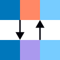

# Using the Chart Styles Add-in

Once the add-in is installed, a **COMPANY Chart Styles** tab appears in the Excel ribbon. All buttons live in this tab, organised into groups.

---

## Creating a chart

1. Select a data range in any worksheet.
2. Click a chart type button. The add-in creates a formatted chart as a new object on the sheet.

If a chart is already active (double-clicked into edit mode) or selected (single-clicked), the button duplicates and reformats that chart instead of creating one from the selection.

| | Button | Chart Type |
|---|---|---|
|  | Column Chart | Clustered vertical bar |
|  | Stacked Column | 100% or absolute stacked vertical bar |
|  | Bar Chart | Clustered horizontal bar |
|  | Stacked Bar | 100% or absolute stacked horizontal bar |
|  | Lollipop Chart | Horizontal lollipop (bar with error-bar sticks and dot markers) |
|  | Line Chart | Standard line chart |
|  | Pie Chart | Pie chart (up to 5 slices) |
|  | Donut Chart | Donut chart (up to 5 slices) |

The pipeline applies automatically: chart size, font, axis styling, gridlines, series colours, title and subtitle text boxes, y-axis label, logo, and a source/notes placeholder.

### Editing placeholder text

After creating a chart, click into the text boxes to replace the placeholder text:

- **TitleBox** — "Title in 20pt sentence case"
- **SubTitleBox** — "Subtitle in 16pt sentence case"
- **YAxisLabelBox** — "Y axis title (unit)"
- **XAxisBox** — "X axis title (unit)"
- **SourceBox** — "Source: …" / "Notes: …"

---

## Colour palette

Seven data colours are used for multi-series charts, applied in palette order:

| | Name | Description |
|---|---|---|
|  | Ocean | Primary blue |
|  | Coral | Warm orange-red |
|  | Sky | Light blue |
|  | Pine | Teal-green |
|  | Gold | Yellow |
|  | Rust | Dark burnt orange |
|  | Lavender | Soft purple |

Silver and White are available as neutral fills. Any series beyond seven falls back to Silver.

### Palette order

The *Toggle Palette Order* button switches between two series colour arrangements:

- **Contrasting** (default): Ocean → Coral → Sky → Pine → Gold → Rust → Lavender
- **Complementary:** Ocean → Lavender → Sky → Pine → Gold → Coral → Rust

Toggle before applying a chart type, or re-apply the chart type after toggling.

---

## Fill colours

The *Fill Colors* group applies a solid colour fill to the selected chart element or shape. Select a series bar, a plot area, a text box, or any shape, then click a colour.

| | | | | | | | | |
|---|---|---|---|---|---|---|---|---|
|  |  |  |  |  |  |  |  |  |
| Ocean | Coral | Sky | Pine | Gold | Rust | Lavender | Silver | White |

---

## Colour ramps

A colour ramp applies a single-hue sequential palette to all series of the active chart, ranging from light to dark. Select or activate a chart, then click a ramp button.

Steps are assigned in spread order (5, 1, 3, 6, 2, 4, 7) so that charts with fewer series still achieve maximum contrast.

| | Ramp | | Ramp |
|---|---|---|---|
|  | Ocean |  | Gold |
|  | Coral |  | Rust |
|  | Sky |  | Lavender |
|  | Pine | | |

Maximum 7 series for single-hue ramps.

### Diverging ramps

A diverging ramp uses two hues: dark-to-light on the left side of the chart, light-to-dark on the right. For an odd number of series, the centre series is assigned a neutral grey.

| | Diverging ramp | Series limit |
|---|---|---|
|  | Ocean — Coral | 15 |
|  | Ocean — Gold | 15 |
|  | Ocean — Rust | 15 |
|  | Pine — Gold | 15 |
|  | Pine — Lavender | 15 |
|  | Pine — Rust | 15 |

### Invert ramp

The  *Invert Ramp* button reverses the current fill colour order across all series without re-applying a ramp. Useful for flipping a ramp direction or reversing a custom colour arrangement.

---

## Chart tools

| | Button | Effect |
|---|---|---|
|  | Toggle Palette Order | Switch series colour order between Contrasting and Complementary |
|  | Invert Ramp | Reverse fill colour order across all series |
|  | Reset to Grey | Reset all series fills to Silver |
|  | Label Last Point | Add series name labels to the last data point (line charts); narrows the plot area to make room |
|  | Toggle Gridlines | Cycle the active chart through four states: none → horizontal → vertical → both |
|  | Remove Legend | Delete the chart legend and resize the plot area |

---

## Exporting a chart

1. Select or activate a chart.
2. Click  *Chart Export*.
3. Choose a folder, file name, and format. Supported formats: **PNG, GIF, JPG, BMP, SVG, PDF**.
4. Click OK. The file is written immediately.

The chosen format is remembered between sessions. The export **does not warn before overwriting** an existing file — check the filename before confirming.

For higher-resolution images (e.g. for print), right-click the chart and select *Save as Picture* instead.
