# Using the Chart Styles Add-in

Once the add-in is installed, a **COMPANY Chart Styles** tab appears in the Excel ribbon. All buttons live in this tab, organised into groups.

---

## Creating a chart

1. Select a data range in any worksheet.
2. Pick a chart type. The add-in creates a formatted chart as a new object on the sheet.

If a chart is already active (double-clicked into edit mode) or selected (single-clicked), the action re-styles that chart instead of creating one from the selection.

Each chart group is a **split button**: clicking the large button body applies the group's default chart, and clicking the dropdown arrow lists every variant in that group.

| | Group | Default (button body) | Dropdown variants |
|---|---|---|---|
|  | Column | Clustered column | Column, Stacked Column, 100% Stacked Column |
|  | Bar | Clustered bar | Bar, Stacked Bar, 100% Stacked Bar, Lollipop |
|  | Line & Area | Line | Line, Area (stacked), 100% Area |
|  | Pie | Pie | Pie, Donut |
| 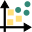 | Scatter | Scatter plot | Scatter Plot, Bubble Plot |
|  | Complex | Treemap | Treemap, Box &amp; Whisker |

> **Lollipop** is a horizontal bar with error-bar sticks and dot markers. **Scatter** and **Bubble** plots expect X/Y numeric data.
>
> **Complex** charts (**Treemap** and **Box &amp; Whisker**, Excel 2016+) are a different kind of chart and are **not interchangeable** with the standard types — you cannot switch a column or pie into one and back the way you can swap between the other families. A treemap shows hierarchical rectangular tiles coloured from the brand palette, with tile labels instead of a legend; a box &amp; whisker shows a coloured box and whiskers per category with a value axis. Because Excel will not place text or images inside these charts, their title, subtitle, logo and source line (and, for box &amp; whisker, the y-axis title) sit alongside the chart as a **grouped** set of shapes. In practice that means: to re-style one, click the chart itself (not the surrounding group); to export it, select the group and use **Chart Export** (saves a PNG). They must be embedded charts on a worksheet, not full chart sheets.

The pipeline applies automatically: chart size, font, axis styling, gridlines, series colours, title/subtitle text boxes, y-axis labels, logo, and a source/notes placeholder.

### Editing placeholder text

After creating a chart, click into the text boxes to replace the placeholder text. The default placeholders also document the intended font sizes and colours:

- **Title box** — "Title in 28pt sentence case"
- **Subtitle box** — "Subtitle in 22pt sentence case"
- **Y-axis label** — "Y axis title (unit)"
- **Source box** — "Source: …" / "Notes: …"

---

## Colour palette

Eight data colours are used for multi-series charts, applied in palette order:

| | Name | Description |
|---|---|---|
|  | Teal | Primary teal-green |
|  | Jasmine | Warm yellow |
|  | Baltic | Deep blue |
|  | Coral | Warm orange |
|  | Sky | Light blue |
|  | Cherry | Deep red |
|  | Blush | Soft pink |
|  | Violet | Rich purple |

Steel and White are available as neutral fills. Any series beyond eight falls back to Steel.

### Palette order

The *Toggle Palette Order* button switches the series colour assignment between two arrangements (Contrasting and Rainbow). Toggle before applying a chart type, or re-apply the chart type after toggling.

---

## Fill colours

The *Fill Colors* group applies a solid colour fill to the selected chart element or shape. Select a series, a plot area, a text box, or any shape, then pick a colour from the **Data Colors** split-button menu. The main button re-applies the last colour you used.

| | | | | | | | | | |
|---|---|---|---|---|---|---|---|---|---|
|  |  |  |  |  |  |  |  |  |  |
| Teal | Jasmine | Baltic | Coral | Sky | Cherry | Blush | Violet | Steel | White |

---

## Colour ramps

A colour ramp applies a single-hue sequential palette to all series of the active chart, ranging from light to dark. Select or activate a chart, then pick a ramp from the **Colour Ramps** split-button menu (the main button re-applies the last ramp used).

Steps are assigned in spread order (6, 2, 4, 3, 5, 7, 8, 1, 9, 10) so that charts with fewer series still achieve maximum contrast.

| | Ramp | | Ramp |
|---|---|---|---|
| 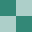 | Teal |  | Sky |
| 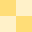 | Jasmine | 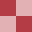 | Cherry |
| 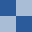 | Baltic | 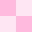 | Blush |
|  | Coral | 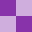 | Violet |

Maximum 10 series for single-hue ramps.

### Diverging ramps

A diverging ramp uses two hues: dark-to-light on the left side of the chart, light-to-dark on the right. For an odd number of series, the centre series is assigned a neutral grey. Pick a combination from the **Diverging Ramps** split-button menu (the main button re-applies the last one used).

| | Diverging ramp | | Diverging ramp |
|---|---|---|---|
| 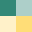 | Teal — Jasmine | 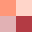 | Coral — Cherry |
| 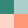 | Teal — Coral | 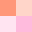 | Coral — Blush |
| 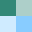 | Teal — Sky |  | Coral — Sky |
| 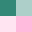 | Teal — Blush | 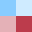 | Sky — Cherry |
|  | Baltic — Jasmine | | |

Maximum 21 series for diverging ramps (10 + grey centre + 10).

---

## Fill actions

| | Button | Effect |
|---|---|---|
|  | Toggle Palette Order | Switch series colour order between the two palette arrangements |
|  | Invert Ramp | Reverse the current fill colour order across all series without re-applying a ramp — useful for flipping a ramp direction or a custom arrangement |
|  | Annotation | Add an editable annotation box to the chart. Select nothing for a box at the plot centre, a data point for a box beside it, or a series for a box near its last point. Runs stack, so you can add several |

---

## Apply chart style

The *Auto Style* group restyles an existing chart in place. Select or activate the chart first.

| | Button | Effect |
|---|---|---|
|  | Apply Chart Style | Apply the house style to the selected chart, whatever its type. Styles what it safely can and leaves the rest unchanged |

---

## Chart tools

The *Toggles* group adjusts an existing chart. Select or activate the chart first.

| | Button | Effect |
|---|---|---|
|  | Toggle Data Labels | Cycle data labels: none → outside end → inside centre. On pie/donut and stacked charts, inside labels use a contrast colour per slice/segment. Applies to the selected series, or all series if none is selected |
|  | Toggle Gridlines | Cycle gridlines: none → horizontal → vertical → both |
|  | Toggle Axis Labels | Cycle axis tick labels: none → x-axis → y-axis → both |
| 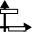 | Toggle Axis Titles | Cycle axis titles: both → y-axis → x-axis → none. Resizes the plot area to match; the y-axis title position follows the legend |
|  | Toggle Legend | Toggle the chart legend on/off and resize the plot area to match |

---

## Exporting a chart

1. Select or activate a chart.
2. Click  *Chart Export*.
3. Choose a folder, file name, and format. Supported formats: **PNG, GIF, JPG, BMP, SVG, PDF**.
4. Click OK. The file is written immediately.

The chosen format is remembered between sessions. The export **does not warn before overwriting** an existing file — check the filename before confirming. Export is **Windows only** (not supported on Mac Excel).

For higher-resolution images (e.g. for print), right-click the chart and select *Save as Picture* instead.
