# Using the Chart Styles Add-in

Once the add-in is installed, a **COMPANY Chart Styles** tab appears in the Excel ribbon. All buttons live in this tab, organised into groups.

---

## Creating a chart

1. Select a data range in any worksheet.
2. Click a chart type button. The add-in creates a formatted chart as a new object on the sheet.

If a chart is already active (double-clicked into edit mode) or selected (single-clicked), the button re-styles that chart instead of creating one from the selection.

| | Button | Chart Type |
|---|---|---|
|  | Column Chart | Clustered vertical column |
|  | Stacked Column | Stacked vertical column |
|  | Line Chart | Standard line chart |
|  | Bar Chart | Clustered horizontal bar |
|  | Lollipop Chart | Horizontal lollipop (bar with error-bar sticks and dot markers) |
|  | Stacked Bar | Stacked horizontal bar |
|  | Pie Chart | Pie chart |
|  | Stacked Area Chart | Stacked area chart |

> **Donut charts:** there is no separate donut button. Create a pie chart, then use **Toggle Variant** (see [Chart tools](#chart-tools)) to switch between pie and donut.

The pipeline applies automatically: chart size, font, axis styling, gridlines, series colours, title/subtitle text boxes, figure and y-axis labels, logo, and a source/notes placeholder.

### Editing placeholder text

After creating a chart, click into the text boxes to replace the placeholder text. The default placeholders also document the intended font sizes and colours:

- **Figure box** — "Figure XX (optional)"
- **Title box** — "Title in 28pt sentence case"
- **Subtitle box** — "Subtitle in 22pt sentence case"
- **Y-axis label** — "Y axis title (unit)"
- **Source box** — "Source: …" / "Notes: …"

---

## Colour palette

Seven data colours are used for multi-series charts, applied in palette order:

| | Name | Description |
|---|---|---|
|  | Ocean | Primary blue |
|  | Coral | Warm orange-red |
|  | Sky | Light blue |
|  | Pine | Teal-green |
|  | Gold | Yellow |
|  | Rust | Dark burnt orange |
|  | Lavender | Soft purple |

Steel and White are available as neutral fills. Any series beyond seven falls back to Steel.

### Palette order

The *Toggle Palette Order* button switches the series colour assignment between two arrangements (Contrasting and Complementary). Toggle before applying a chart type, or re-apply the chart type after toggling.

---

## Fill colours

The *Fill Colors* group applies a solid colour fill to the selected chart element or shape. Select a series, a plot area, a text box, or any shape, then pick a colour from the **Data Colors** split-button menu. The main button re-applies the last colour you used.

| | | | | | | | | |
|---|---|---|---|---|---|---|---|---|
|  |  |  |  |  |  |  |  |  |
| Ocean | Coral | Sky | Pine | Gold | Rust | Lavender | Steel | White |

---

## Colour ramps

A colour ramp applies a single-hue sequential palette to all series of the active chart, ranging from light to dark. Select or activate a chart, then pick a ramp from the **Colour Ramps** split-button menu (the main button re-applies the last ramp used).

Steps are assigned in spread order (5, 2, 3, 6, 1, 4, 7) so that charts with fewer series still achieve maximum contrast.

| | Ramp | | Ramp |
|---|---|---|---|
|  | Ocean | 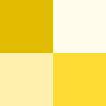 | Gold |
| 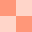 | Coral | 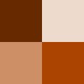 | Rust |
| 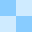 | Sky | 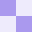 | Lavender |
| 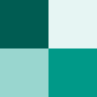 | Pine | | |

Maximum 7 series for single-hue ramps.

### Diverging ramps

A diverging ramp uses two hues: dark-to-light on the left side of the chart, light-to-dark on the right. For an odd number of series, the centre series is assigned a neutral grey. Pick a combination from the **Diverging Ramps** split-button menu (the main button re-applies the last one used).

| | Diverging ramp | | Diverging ramp |
|---|---|---|---|
| 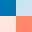 | Ocean — Coral | 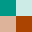 | Pine — Rust |
|  | Ocean — Pine | 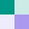 | Pine — Lavender |
|  | Ocean — Gold | 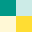 | Pine — Gold |
| 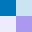 | Ocean — Lavender | 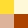 | Gold — Rust |
| 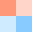 | Sky — Coral | | |

Maximum 15 series for diverging ramps (7 + grey centre + 7).

---

## Fill actions

| | Button | Effect |
|---|---|---|
|  | Toggle Palette Order | Switch series colour order between the two palette arrangements |
|  | Invert Ramp | Reverse the current fill colour order across all series without re-applying a ramp — useful for flipping a ramp direction or a custom arrangement |

---

## Chart tools

The *Customisation* group adjusts an existing chart. Select or activate the chart first.

| | Button | Effect |
|---|---|---|
|  | Label Last Point | Duplicate the chart and add series-name labels to the last data point of each series (line charts); narrows the plot area to make room |
|  | Toggle Data Labels | Cycle data labels: none → outside end → inside centre. On pie/donut and stacked charts, inside labels use a contrast colour per slice/segment. Applies to the selected series, or all series if none is selected |
| 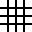 | Toggle Gridlines | Cycle gridlines: none → horizontal → vertical → both |
| 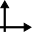 | Toggle Axis Labels | Cycle axis tick labels: none → x-axis → y-axis → both |
|  | Toggle Legend | Toggle the chart legend on/off and resize the plot area to match |
|  | Toggle Variant | Switch between chart-type variants: stacked ↔ 100% stacked, pie ↔ donut, line ↔ line with markers |

---

## Exporting a chart

1. Select or activate a chart.
2. Click  *Chart Export*.
3. Choose a folder, file name, and format. Supported formats: **PNG, GIF, JPG, BMP, SVG, PDF**.
4. Click OK. The file is written immediately.

The chosen format is remembered between sessions. The export **does not warn before overwriting** an existing file — check the filename before confirming. Export is **Windows only** (not supported on Mac Excel).

For higher-resolution images (e.g. for print), right-click the chart and select *Save as Picture* instead.
